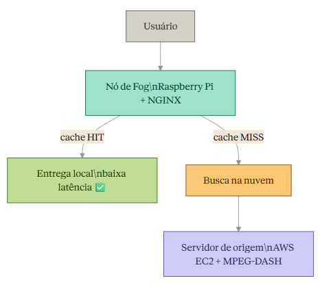

# 🌫️ ASMFog — Fog Computing para Streaming de Vídeo

> Projeto de TCC em desenvolvimento — Ciência da Computação | IFPA

## 📖 Sobre o Projeto

O crescimento do tráfego de dados nas redes tem gerado um problema real: aumento de latência, instabilidade e degradação no acesso a conteúdos multimídia — mesmo em ambientes urbanos e institucionais com alta demanda simultânea ou restrições de largura de banda.

Este projeto propõe a **arquitetura ASMFog**, uma solução baseada em fog computing com o objetivo de otimizar a experiência do usuário no consumo de conteúdo multimídia. A arquitetura distribui o processamento entre a nuvem e a borda da rede, reduzindo a dependência exclusiva de servidores em nuvem e melhorando a entrega de conteúdo em cenários com degradação de conectividade.

---

## 🏗️ Como Funciona



No **primeiro acesso**, o conteúdo é buscado na nuvem e armazenado localmente no nó de fog. Nos **acessos seguintes**, o próprio nó entrega o conteúdo diretamente ao usuário, reduzindo latência e consumo de banda.

Os vídeos são processados com **FFmpeg** em múltiplas resoluções (720p e 480p) e entregues via **MPEG-DASH**, adaptando a qualidade conforme as condições da rede.

---

## ⚙️ Stack Técnica

| Ferramenta | Uso |
|---|---|
| AWS EC2 | Servidor de origem dos vídeos |
| AWS ECR | Repositório de imagens Docker |
| AWS S3 | Backend do estado do Terraform |
| Terraform | Provisionamento da infraestrutura (IaC) |
| Docker + NGINX | Containerização e entrega da aplicação |
| FFmpeg | Processamento de vídeos em múltiplas resoluções |
| MPEG-DASH | Streaming adaptativo conforme condições da rede |
| GitHub Actions | Automação do CI/CD |

---

## 🗂️ Estrutura dos Repositórios

```
Project-automation-TCC-app/       ← Aplicação
├── .github/
│   └── workflows/
│       └── deploy.yaml           ← Pipeline de build e deploy
├── app/
│   ├── Videos/                   ← Vídeos processados pelo FFmpeg
│   ├── index.html
│   ├── script.js
│   └── style.css
└── Dockerfile                    ← NGINX servindo a aplicação

Project-automation-TCC-infra/     ← Infraestrutura
├── .github/
│   └── workflows/
│       └── terraform.yaml        ← Pipeline Terraform
├── ec2.tf                        ← Instância EC2
├── ecr.tf                        ← Repositório de imagens
├── backend.tf                    ← Backend S3
├── provider.tf                   ← Provider AWS
└── user_data.sh                  ← Instalação automática do Docker
```

---

## 🔄 Fluxo CI/CD

### Pipeline da Aplicação (deploy.yaml)
Disparado automaticamente a cada `git push` na branch `main`:

```
git push
    ↓
Instala FFmpeg
    ↓
Processa vídeos em 720p e 480p automaticamente
    ↓
Build da imagem Docker
    ↓
Push pro ECR
    ↓
Deploy na EC2 via SSH
```

### Pipeline de Infraestrutura (terraform.yaml)
Disparado manualmente via `workflow_dispatch`:

```
terraform init
    ↓
terraform validate
    ↓
terraform plan
    ↓
terraform apply  ← cria a infraestrutura na AWS
    ↓
terraform destroy ← remove e para a cobrança
```

---

## 🔧 Pré-requisitos

### Ferramentas
- [Terraform](https://developer.hashicorp.com/terraform/tutorials/aws-get-started/install-cli)
- [AWS CLI](https://docs.aws.amazon.com/cli/latest/userguide/getting-started-install.html)
- [Docker](https://docs.docker.com/get-docker/)
- [Git](https://git-scm.com/)

### Conta AWS
- Conta ativa na [AWS](https://aws.amazon.com)
- IAM Role configurada para o GitHub Actions (OIDC)
- IAM Role `EC2-ECR-Role` para a instância EC2

### GitHub Secrets necessários

| Secret | Descrição |
|---|---|
| `ID_AWS` | ID da conta AWS |
| `TF_PUBLIC_KEY` | Chave pública SSH para acesso à EC2 |
| `PRIVATE_KEY` | Chave privada SSH para deploy |
| `PUBLIC_IP` | IP público da EC2 (após terraform apply) |

---

## 🚀 Como Usar

### 1. Clone os repositórios
```bash
git clone https://github.com/seu-usuario/Project-automation-TCC-infra.git
git clone https://github.com/seu-usuario/Project-automation-TCC-app.git
```

### 2. Gere a chave SSH
```bash
ssh-keygen -t rsa -b 4096 -C "seu-email@exemplo.com"
```

Adicione o conteúdo de `site-prod-key.pub` no GitHub Secret `TF_PUBLIC_KEY`.

### 3. Suba a infraestrutura
No repositório de infra, execute a pipeline `terraform.yaml` manualmente e selecione `apply = true`.

### 4. Faça deploy da aplicação
No repositório da app, faça um `git push` na branch `main`. A pipeline executa automaticamente.

### 5. Destrua a infraestrutura (quando terminar)
Execute a pipeline `terraform.yaml` com `destroy = true` para evitar cobranças.

---

## ⚠️ Observações

- Sempre execute `terraform destroy` ao terminar os testes para evitar cobranças desnecessárias
- Nunca suba arquivos `.tfstate`, `.tfvars` ou chaves privadas no GitHub
- Adicione ao `.gitignore`:

```
*.tfstate
*.tfstate.backup
*.tfvars
.terraform/
```

---

## 🎓 O que foi Aprendido

✅ Provisionar infraestrutura AWS com Terraform (IaC)  
✅ Containerizar e servir aplicação com Docker + NGINX  
✅ Automatizar processamento de vídeos com FFmpeg via pipeline  
✅ Implementar CI/CD completo com GitHub Actions  
✅ Configurar autenticação segura com IAM Role + OIDC  
✅ Aplicar conceitos de fog computing na prática  

---

## 📚 Recursos

- [Documentação Terraform AWS](https://registry.terraform.io/providers/hashicorp/aws/latest/docs)
- [FFmpeg Documentation](https://ffmpeg.org/documentation.html)
- [MPEG-DASH](https://dashif.org/)
- [AWS ECR](https://docs.aws.amazon.com/ecr/)
- [GitHub Actions](https://docs.github.com/en/actions)

---

## 👨‍💻 Autor

Eduardo — Ciência da Computação | IFPA  
[LinkedIn](https://www.linkedin.com/in/eduardov-goncalves/) · [GitHub](https://github.com/Edugon0)
